## *2sPred* - *Store Sales Prediction.*
###  Data Science Sales Estimator: Project Overview

This project was developed for sales forecasting at Rossmann, a German-based drugstore chain with operations in more than 3,000 stores in seven European countries. The dataset is publicly available in a Kaggle competition.

the main goal was:

- Creation of a Bot for telegram to help managers and CFO check, from wherever they are, the sales value for each store.

- Data analysis, which is validated and disproved hypotheses about characteristics of the profile of stores that sell more so can help the business and marketing teams to assertively customize decision making
### Code and Resources Used
**Python Version:** 3.7                                                                                                                   
**Packages:** Pandas, Numpy, Sklearn, Matplotlib, Seaborn, Flask, Pickle, Reflection.                                             


____

#### note: To do not turn this readme so extensively, I'll comment only on some points about this project. I wanna thank you to be here and if you have some suggestions or want to contact me for whatever reason, feel free.
  <a href="https://www.linkedin.com/in/jean-rodrigues/" target="_blank"></a> 
____

#### It's time to contextualize our business problem, so take a coffee and lets to a little story.

You are the data scientist at Rossmann and suddenly you start receiving calls, emails, and telegram messages from many managers. They are contacting you to ask for a sales forecast for the next 6 weeks.

Immediately this scares, indeed!! after all, there are more than 60 managers - burnout is coming!!  just joking :p -. Analytical thinking already starts here, Let's take a look at something a kind of interesting: Many managers are asking the same thing, **what is happening here?** This is the first question I'm supposed to seek to understand.

The managers are asking me for a forecast for the next few weeks, ok!! Time to understand the problem. 
Talking to one of the managers, I understood the context: The company's CFO gathered the managers and asked for the sales forecast for the next six weeks, well... I found out who was the stakeholder, and therefore I decided to contact him directly.
 
I investigated a few more points and understood that behind this request, there was a well-defined context: Roger wants to renovate the stores and to decide how much to invest in these renovations, he would like to know how much cash flow of each store will get, so he could advance that money to renovate stores.

The stakeholder plays an important role in a data scientist, he is the one who guides the data scientist in solving the problem and this prevents us from modeling a solution that does not meet their expectations or other questions about ROI (Return on investment). 

Finally, we decided  delivery method and granularity:

#### Roger needs access the sales forecast from the cell phone and the granularity will be per week!
 
____
## Machine Learning results


After applying cross-validation for all model that was suggested to be used, the chosen model was XGBoost. Initially, the model did not present satisfactory results, so it was necessary feature engineering, fine tunning. After that, the model got the following performances:

- ```MAE```: _766.47_

- ```MAPE```: _011_

- ```RMSE```: _1098._

  To better understand, these metrics mean that the error average is 766.47 (This value refers to budget). It can be above or below compared to real value,  and this means a total of 11% compared to the entire prediction. (As shown in figure 1). Roger (CFO) got a little confused. In order to clear things up:  _figure two_ shows, for each store, a best and worst scenario for the sales. The margin of error in relation to the total sales value is majority low, as shown in Figure 4. Values ​​for the mean absolute percentage error, are concentrated around 10%. 

To simplify even more, there are two scenarios, the worst and the best (figure 3). The difference between the worst and best scenario is _1,715,379_. At best, sales will reach _287,943,717_ and at worst _286,228,337_. (In figure 3 this value refers to sales of all stores)

Note: The idea here is to report the results. This step **isn't that easy** to implement as reported here.

## Bot telegram working

### Data preprocessing

Following the methodology that was used in this project, crisp-ds, after receiving and understanding the business problem with our team, I would collect the data. In this case, the data has already been collected and summarized in a single dataset, so we will skip this step

- #### Data Description
  
   - The **data description** step is important because it leads us to understand how the data is:
   - what is the dimension of the set, are we dealing with big data? - What kind of variable is in this dataset? What percentage of each one? 
   - There is Missing data? if yes, what is the volume and reasons for these missing data existing? Errors in the collection system? In manual data input? 

-> The answers to these questions guide the way we'll handle the problem.
 
- #### Descriptive Statistic
  
    - **descriptive statistics** in its turn, shows us the behavior of our dataset, quantitatively speaking, and for that, we use statistical concepts to measure the dispersion (Variance, Standard Deviation, Range, Minimum and Maximum values, Skewness, Kurtosis) and **central tendency** (mean, median).

This step will answer us these questions.
 


#### It is interesting to emphasize the investigative mindset that is required for data scientists at the time of these initial analyses. From the moment we receive the business problem, we have to be clinically analytical. This is one of the things that incline us to scientific methodology. The image below illustrates superficially the scientific methodology.

 

- ####  Data Cleaning

This is an important task in any data science project. Most algorithms, in terms of machine learning, are not built to deal with missing values or data that is in the wrong data type. This step aimed two main tasks:
  
  
   **Change data types**: When you get data, some features are in the wrong format (e.g: "Date" variable, commonly, it's in string format instead of "date" format) and it isn't appropriate to work on it. 
  

  **Imputation**: Missing values exist!! When you're working on a project and face missing values, there are basically three ways to handle it:
    
   - To collect more data or generate more data by imbalanced-learn package (undersampling, oversampling technics)
   - To understand the reasons behind missing values look toward business questions.
   - And finally, the easiest way to deal with that, deleting.

**As an example, the figure below represents the relative count of missing data in this analysis**  
  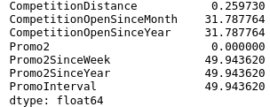
  
The percentage amount of missing data is a substantial value, so excluding it's out of the question, so it remains for us to treat it thinking about business, for that, let's go to a brief description of each variable:
   
   - **CompetitionDistante**: _Distance in meters to the nearest competitor store
    
   - **CompetitionOpenSinceMonth/Year**: _gives the approximate year and month of the time the nearest competitor was opened_  
    
   - **PromoSinceWeek/Year**: _describes the year and calendar week when the store started participating in Promo2_
    
   - **PromoInterval**: _describes the consecutive intervals Promo2 is started, naming the months the promotion is started_
    
To understand what the data cleaning approaches were:

- **CompetitionOpenSinceMonth**  -> Filled with **month** that is located in ```date```
- **CompetitionOpenSinceYear**   -> Filled with **year** located in ```date```
- **PromoSinceWeek**             -> Filled with **week** derivated from ```date```
- **PromoSinceYear**             -> Filled with **year** located in ```date```

*The logic behind these data imputation: "If there're null values in these columns both CompetitionOpenSinceMonth/Year or PromoSinceWeek/Year, we can assume that: 'The first occurrence that was observed, is the week/year that there into date feature, then, we can fill it with a week or year accordantly with the date*

- **PromoInterval** filled with null values with 0 (the store is not participating in consecutive promo sales). With promo_interval, a dummy variable is_promo2 was created to indicate whether a store is holding consecutive promo sales on that day.**
-
- **CompetitionDistance:** It is expressed in meters but, sometimes it was NaN value, so for this case, I assumed that there wasn't Competition with stores around or Competitors are so far away, that we can assume that there's no competition. To not delete this entire observation, I assumed a value higher than the highest value in the dataset.**

____

### MindMap Hypothesis
In order to guide EDA step, it was created a *mindmap hypothesis* containing some question to be answer. In a corporation, this mindmap, easealy, comes from a mind storming with the team.
_____
### EDA

### I. Univariate Analysis
#### - Target Variable: distribution looks like a Poisson distribution, with a positive skew and right tail. We will need to rescale our data before training the model.
 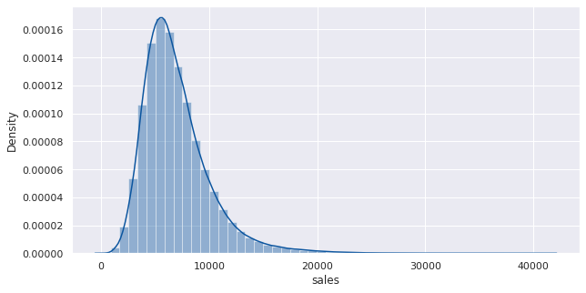

#### Numerical Variables 
 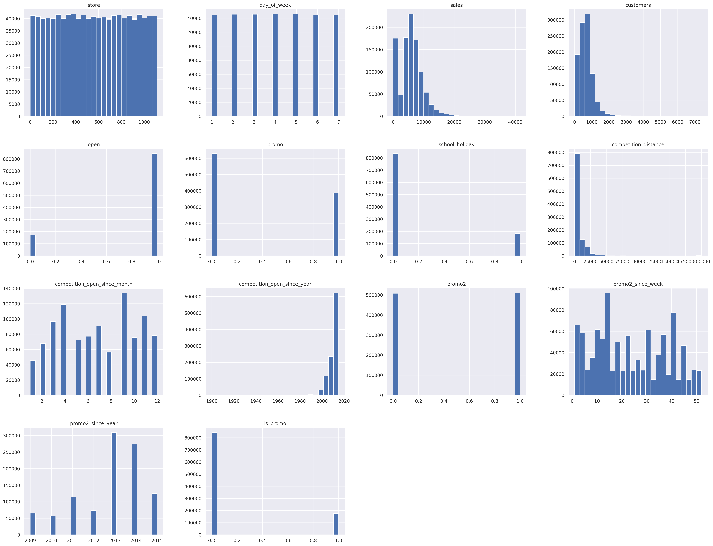
 
   **Note**
   All variables don't follow a normal distribution;
This graph was usefull to take some insight to guide our mindmap hypothesis since it gives us a superficial understand on data. 


- **Categorical Variables**
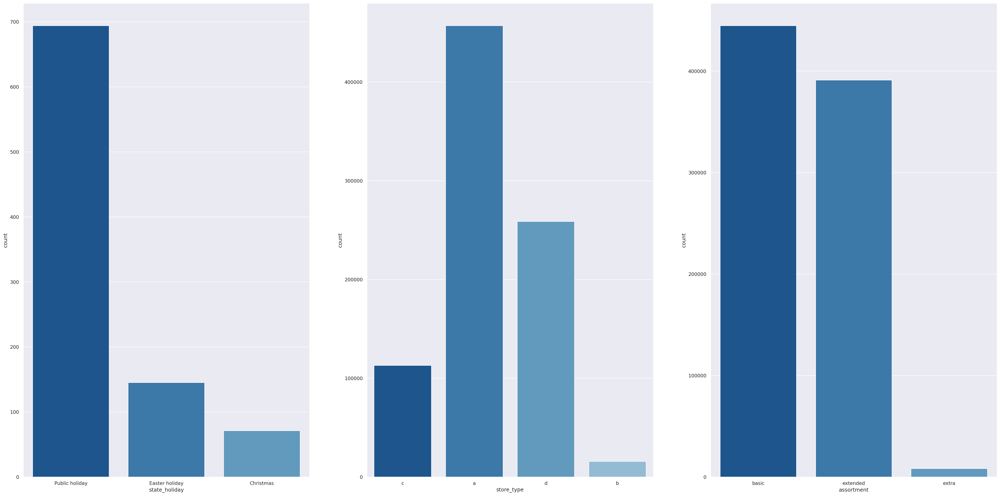

- **Note**
  
  - ```state_holiday```: It's clear that exists more sales on public holidays. Easter and Christmas aren't substancialy diffent. (Fig 1)
  
  - ```store_type```: There are more sales for store of type "a". Store of type 'b' is the smallest when we are talking about saling. (Fig 2)
  
  - ```assortment```: Stores with Assortment of type "extra" are the ones that sell least. (Fig 3)
______

### II. Bivareate Analysis
Now our focus goes to the bivariate analysis: How each independent variable behaves against the dependent variable (sales)? Here we validate or not our hypothesis list and raise valuable insights for the business team. I can't forget to point out that is, usually, in this step, we analyze a variable's relevancy to the model.

- ### Stores with consecutive promotions sell more.
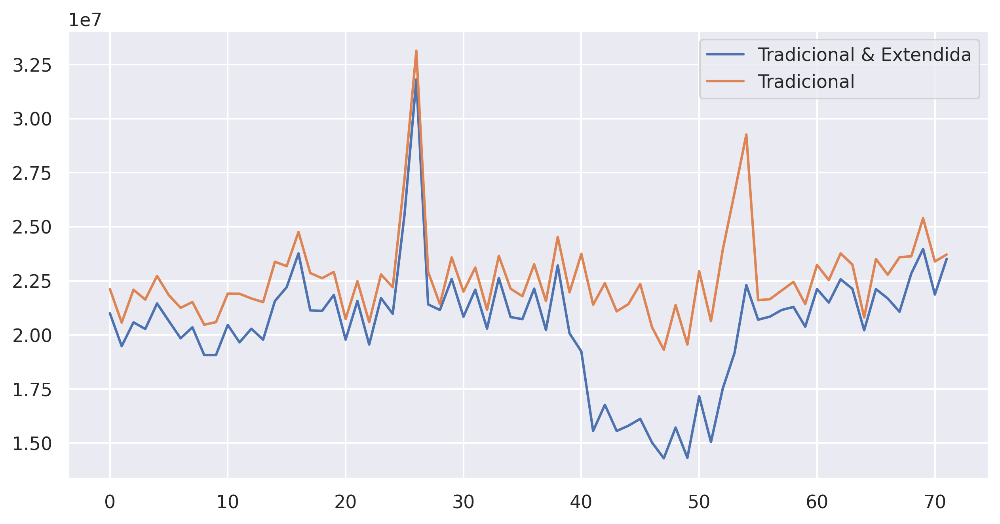
 
 - **False**
  - Stores with consecutive promotions, despite having a behavior similar to that of stores with Traditional promotions, it doesn't give an advantage in selling. Apparently, after a certain time, sell fall drastically to this store that maintains consecutive promotion 

- ### Stores open over Christmas holiday should sell more.
 
 
 
  - **FALSE**
    - _Stores sell more on public holidays and Easter. However, but we have to point out that our data doesn't capture Christmas sales in 2015. It goes until mid-June._
 
 
- ### Over the year, stores should sell more.
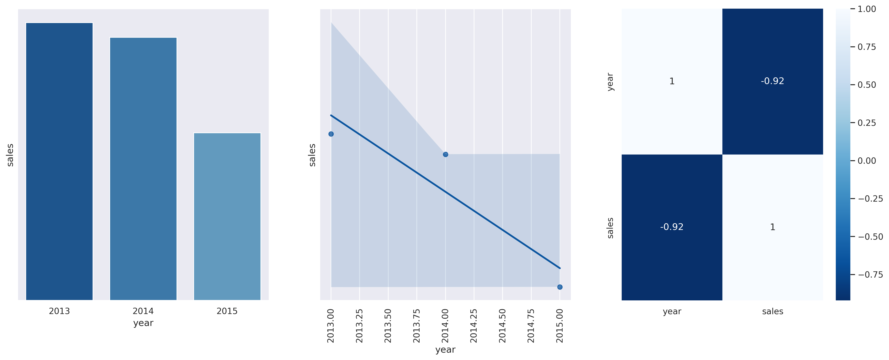

 - **FALSE**
    - _Our data completely show the opposite of this hypothesis: Stores are selling less along the years, and year has a strong negative linear correlation with sales (-0.92). However, the year 2015 is not closed (dataset goes till mid-2015) as I said previously._


 - ### Stores sell more during the 2nd semester
 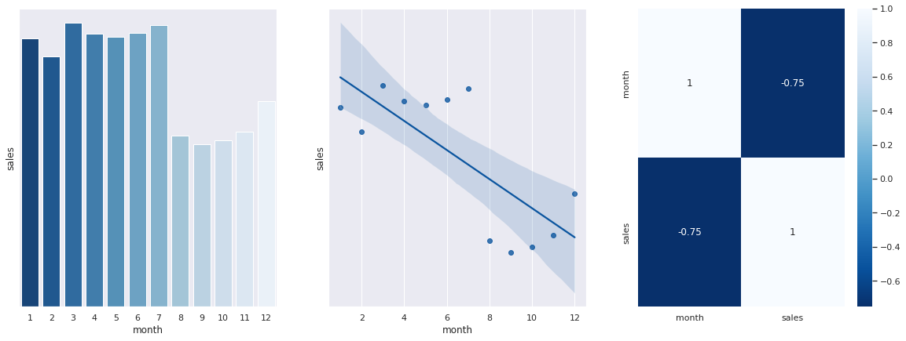
 
  - **FALSE**
 
    - _Stores sell more on the 1st semester.The heatmap (fig 3) shows that month and sales have a strong negative linear correlation: as the months goes by, sales decrease._
 

 - ### Stores with extended ```assortment``` type sell more 

For the variable assortment, we have three types of assortment: _basic, extended, and extra_.


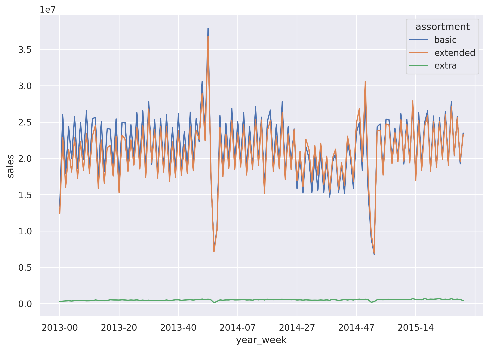
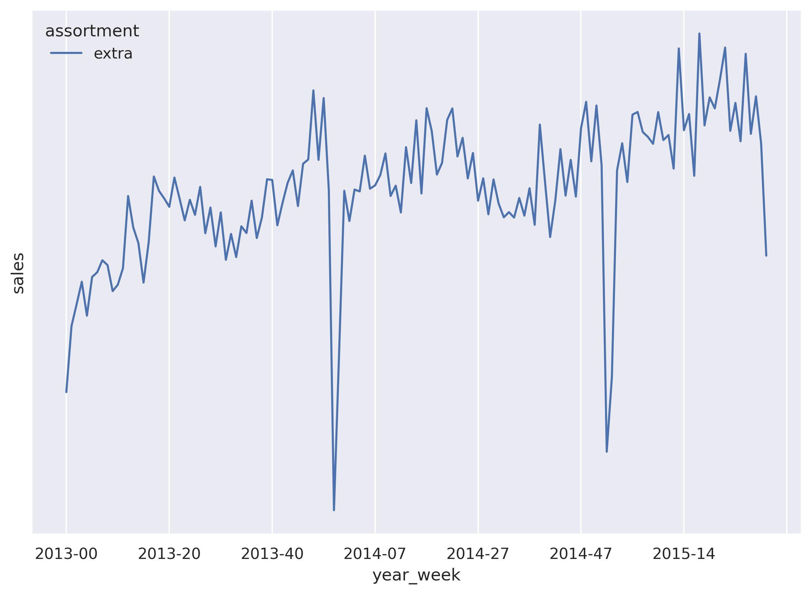

 - **FALSE**
    - _Bigger assortment sell less. However, the number of data points for stores with assortment 'extra' is very low compared to the others. Assortment 'extra' follows a similar sales pattern of the others (fig3)._
 
 - ### Stores with near competitors sell less.

The variable ```competition_distance``` is the distance from a Rossmann store to another store (competitor)

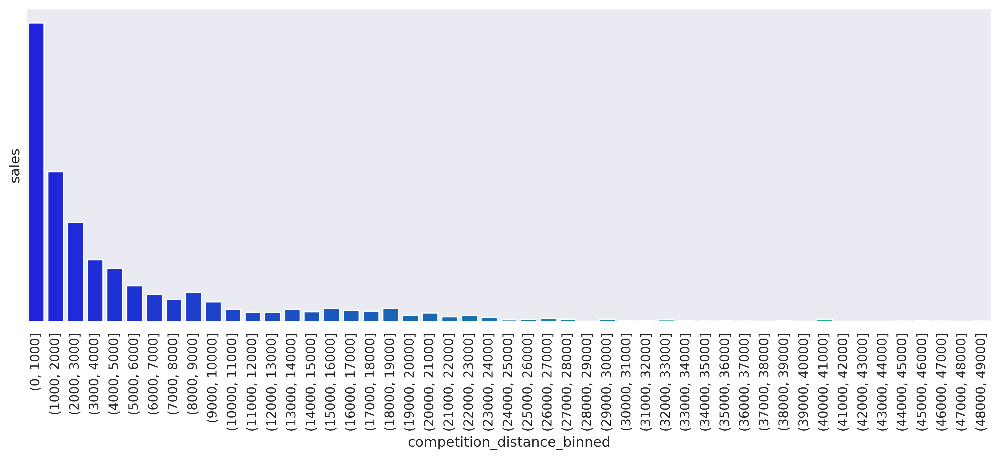
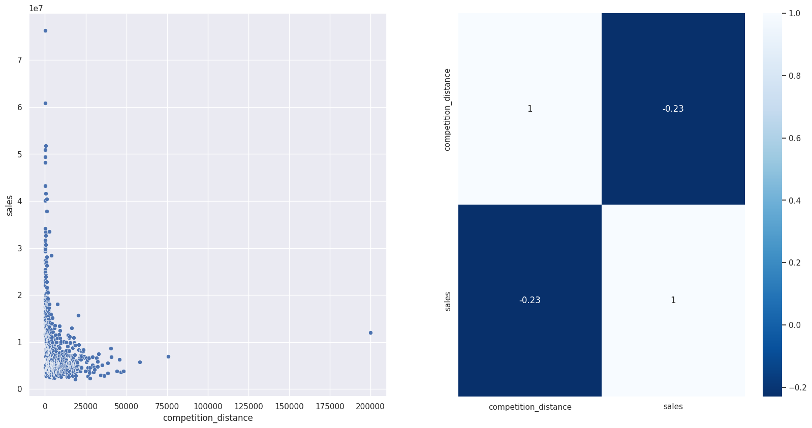

- **FALSE**
    - _Stores near competitors, surprisingly, sell more than stores with competitors far away. We can tell that it's because data is concentrated within the range distance of 0-20000 meters (fig 3). But, maybe not! From the barplot (fig 1), we see that sales are higher for stores with competitors within 0-1000 meters.The second graph (from left to right), in the second line is a heatmap. The negative value -0.23 inside the dark blue square is the pearson correlation. It means, as competition distance increase, sales revenues decrease._


 - ### Stores with longer competitors sell more. 
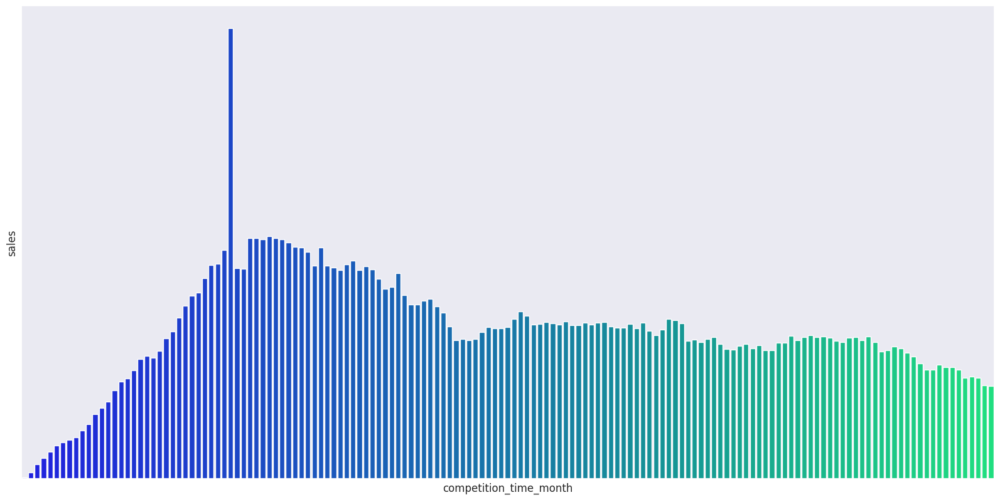

 - **FALSE**
 
 - ### Stores with consecutive promotions for longer time, sell more.
 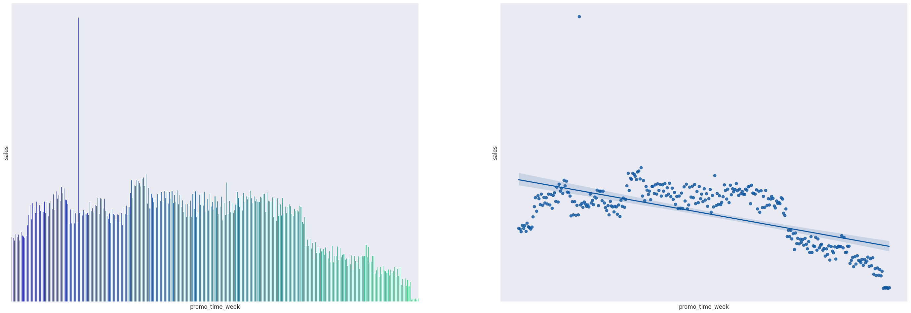
 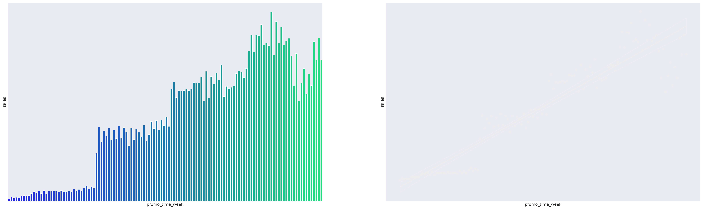

- **FALSE**

- ### Stores sell less over school holidays.

 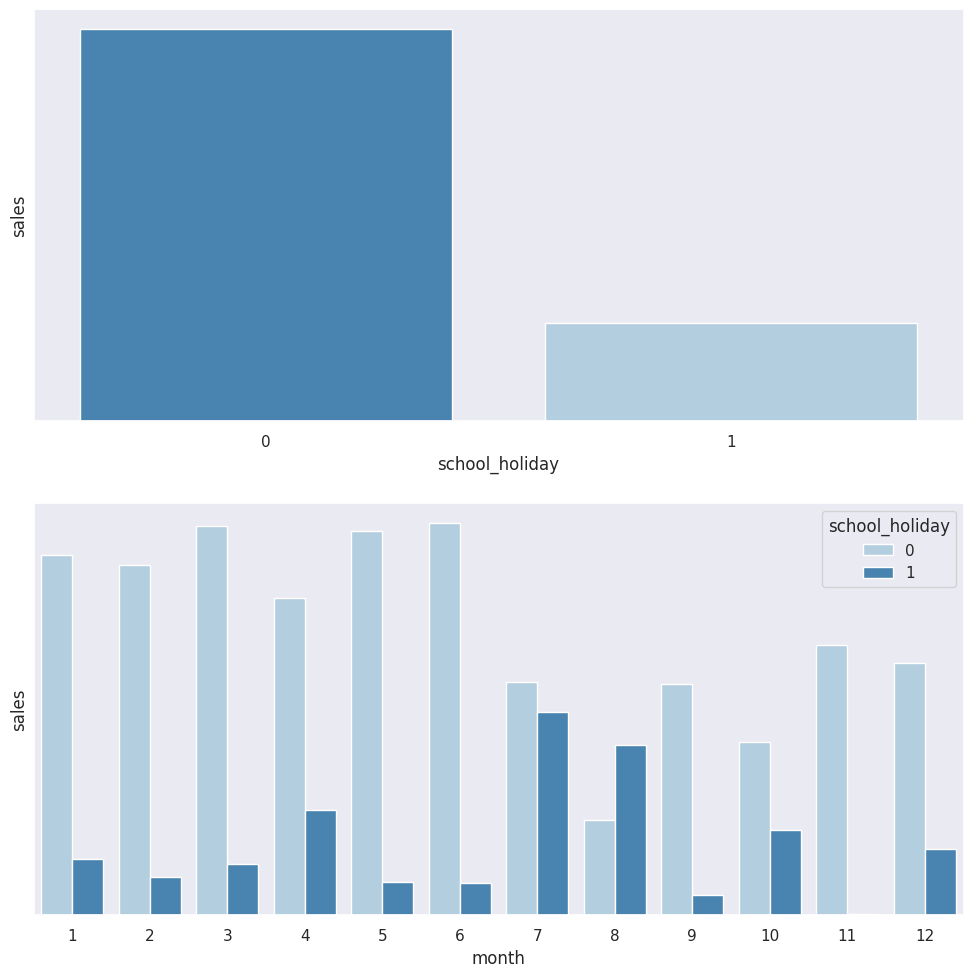
 
  - **TRUE**
 
    - _Stores sell less during school holidays! It's interesting look at Sept and August month, sales increase over these months, and this phenomenon happens, probably, because it's school vacation, so, if it's school holiday or not, it does not matter._

 - ### Stores sell less on weekends.
 
 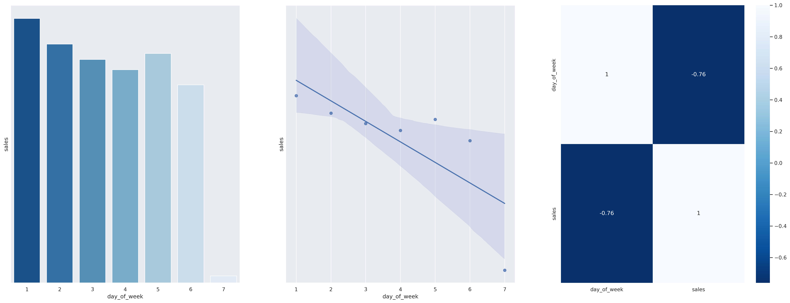
 
  - **True**
 
    - _From the barplot above, sales are bigger on weekdays than on weekends. The barplot above ( fig 1) shows that Rossmann stores sell more on Mondays (represented by column 1), Across the weekdays (2-5 columns) has a good sale performance, and after, it declines till the worst day of sales on Sundays (7).As shown in the heatmap and scatterplot, the variable day_of_week shows a strong linear negative correlation with sales, which indicates that day_of_week is probably an essential feature to explain our target variable._

 - ### Stores sell more after the 10th day.
 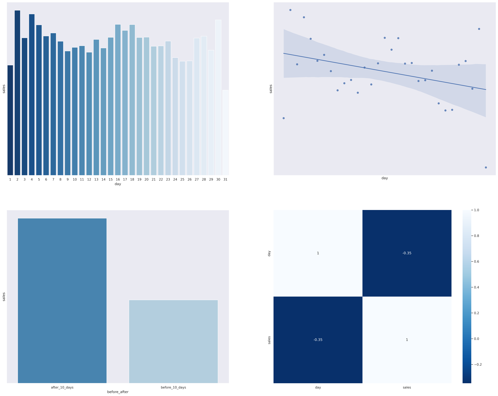
 
  - **True**
 
 In some companies, the salary payment is set on day 10 every month. To analyze the effect of sales before and after day 10, it was created the variables ```before_day_10``` and ```after_day_10```.
 
 ### Multivareate Analysis 
In multivariate analysis, we have to answer basicly two questions:

1 - **Target variable & independent variables (predictors)**: is there any predictor in our dataset that is highly correlated to the target? If so, this predictor is an important feature of our prediction model.

2 - **Independent variables**: is there any predictor that is highly correlated to another predictor? If so, we might consider removing one of them since they "explain" the target variable. We have to remove one or the other due to two reasons: 
  - (1) In machine learning models, a simpler model is preferred (Occam's razor principle).
  - (2) It eliminates multicollinearity problems, which can be a serious headache on linear regression models once independent variables should be independent of each other. Models full of highly correlated independent variables creates a lot of noise on the model, thus that makes our sales prediction no assertive
 
  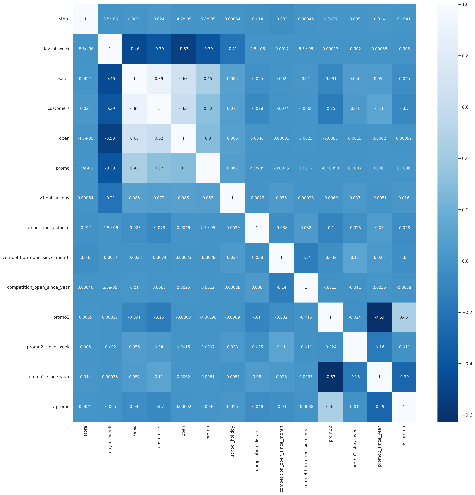

 
 Note:
 
 Target variable and independent variables.

**Variables with positive correlation with sales:**
- Weak: ```is_weekday```, ```promo2_since_year```
- Medium: ```promo```
- Strong: ```customers```


Negative correlation with sales:
Weak: ```day_of_the_week```, ```ìs_promo```,```promo2```
Medium: -
Strong: -


____
### Data Modeling

**"O aprendizado de maquinas é facilitado com dados numéricos e na mesma escala"** 

A ideia da modelagem dos dados em um projeto de ciencia de dados é resolver basicamente dois problemas:

- 1. Como mencionei antes, os modelos (_pelo menos a maioria_) foram engenheirados para lidar de uma maneira melhor com dados numérico, porém, existem dados categóricos dentro do conjunto de dados, o que dificulta a performance do modelo, e os mesmo precisarão ser transformados em numericos.

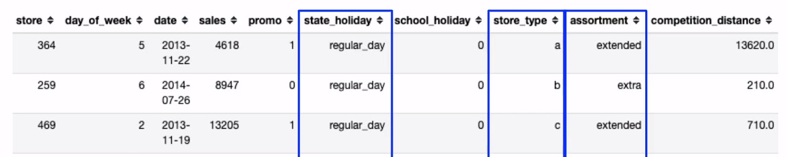

Para essas variaveis categoricas, salientadas na imagem acima, utilizamos tecnicas diferentes.

Para ```state_holiday``` foi utilizado uma técnica chamada OneHotEncoding. 
Para ```store_type``` foi utilizado a técnica Label Enconder e por fim para ```assortment``` foi utilizado Order Encoder.

_Para quem tiver interesse e para reduzir o tamanho desse readme, vou recomendar essa leitura <https://towardsdatascience.com/all-about-categorical-variable-encoding-305f3361fd02> para entender os por menores técnicos das técnicas escolhidas nesse projeto._


- 2. As variaveis com maior range, como mostra a imagem abaixo, e isso tende a inviesar o modelo. Então para lidar com esse problema, precisamos deixar as variaveis em uma mesma escala a fim de contornar o problema de vies.

 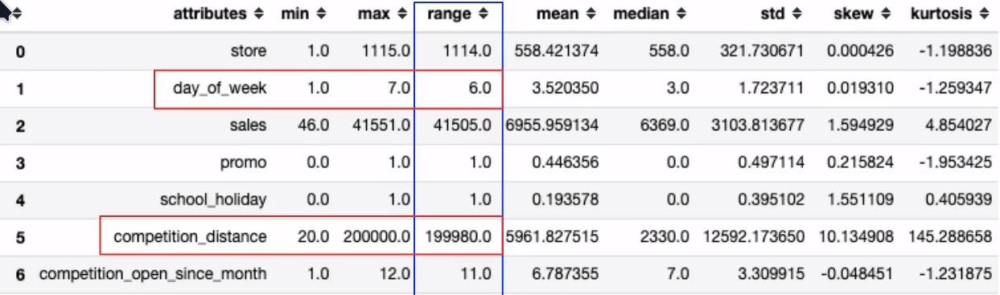
 
 
 Para regularizar de maneira assertiva as features ```competition_distance```, ```year```, ```competition_time_month``` e ```promo_time_week``` é preciso checar sua distribuição para entender se as mesmas apresentam outliers e isso define qual sera a técnica utilizada aqui. Para essas **reescalar** foi utilizado **RobustScaler** uma função do modulo **preprocessing** da biblioteca **Sklearn**.
 
 ```day_of_week```, ```competition_distance```, ```year```, ```month```, ```day```, ```week_of_year```, ```competition_time_month```, ```promo_time_week``` 

### Productionization
_____
